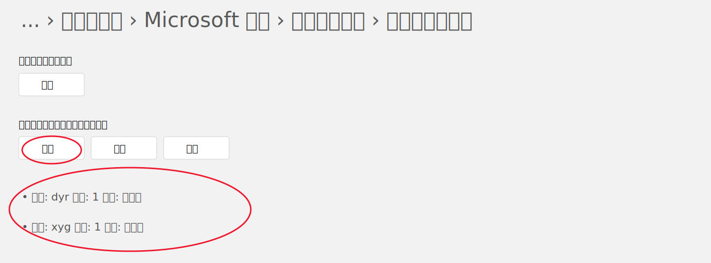

# 微软拼音 DAT 生成与查看工具

一个本地运行的轻量 Web 工具，用来从中文姓名列表生成微软拼音可导入的 DAT 文件，也可以上传已有 DAT 文件反向查看其中的词条和编码。

本项目只处理本地文件，不会自动导入微软拼音，不会修改系统设置，不会写注册表，也不提供安装程序。

## 功能

- 从手工输入的姓名列表生成 DAT 文件
- 从 `txt`、`csv`、`xlsx` 文件读取姓名
- 生成前预览并手工修改编码
- 支持查看已有微软拼音 DAT 文件
- 自动识别常见 DAT 类型
- 在本地浏览器中运行，数据不上传到远端服务

## 支持的 DAT 类型

| 类型 | 输出文件 | ImeWlConverter 格式 | 编码方式 | 用途 |
| --- | --- | --- | --- | --- |
| 用户自定义短语 DAT | `dist/UserDefinedPhrase.dat` | `win10mspy` | 拼音首字母 | 导入到微软拼音“用户自定义短语” |
| 自学习词汇 DAT | `dist/SelfStudyPhrase.dat` | `win10mspyss` | 全拼编码 | 导入到微软拼音“自学习词汇” |

用户自定义短语示例：

```text
张三 -> zs
王小明 -> wxm
```

自学习词汇示例：

```text
张三 -> zhang san
王小明 -> wang xiao ming
```

自学习词汇不能使用首字母，必须使用全拼编码。

## 技术来源说明

本项目的 DAT 转换能力来自公开项目：

- 项目：深蓝词库转换 / ImeWlConverter
- GitHub：`https://github.com/studyzy/imewlconverter`
- 本项目用途：通过其命令行程序 `ImeWlConverterCmd` 在 `sgpy`、`win10mspy`、`win10mspyss` 格式之间转换
- 授权：GPL-3.0，授权文本见 [LICENSES/GPL-3.0.txt](LICENSES/GPL-3.0.txt)

本项目没有重新实现微软拼音 DAT 的底层格式读写。`app.py` 负责姓名解析、编码生成、预览、文件上传下载和调用命令行转换器；真正的 DAT 编解码由 `ImeWlConverterCmd` 完成。

更完整的第三方依赖和归属说明见 [docs/THIRD_PARTY.md](docs/THIRD_PARTY.md)。

## 运行环境

需要：

- Python 3.10+
- `ImeWlConverter` 命令行工具

仓库中已经包含 Linux x64 版默认转换器：

```text
imewlconverter_linux/publish/linux-x64/ImeWlConverterCmd
```

如果该文件存在，页面里的 `ImeWlConverter 路径` 可以不填，后端会默认使用它。

也可以手动填写其他转换器路径，例如：

```text
/home/xiong/dev/pinyin-converter/imewlconverter_linux/publish/linux-x64/ImeWlConverterCmd
```

Windows Python 下可以填写 Windows 可执行文件路径：

```text
C:\Tools\ImeWlConverterCmd.exe
```

WSL 环境建议优先使用 Linux 版 `ImeWlConverterCmd`。

## 安装与启动

进入项目目录：

```bash
cd ~/dev/pinyin-converter
```

创建并进入虚拟环境：

```bash
python -m venv .venv
source .venv/bin/activate
```

安装依赖：

```bash
pip install -r requirements.txt
```

启动：

```bash
python app.py
```

浏览器打开：

```text
http://localhost:5000
```

Flask 启动时出现下面提示是正常的：

```text
WARNING: This is a development server. Do not use it in a production deployment.
```

如果提示端口被占用，可以直接打开已有服务，或停止旧进程后重新启动。

## 使用流程

### 生成 DAT

1. 选择生成模式
2. 手工输入姓名，或上传 `txt`、`csv`、`xlsx`
3. 点击“解析并预览”
4. 在表格里检查并手工修改编码
5. 点击“生成 DAT”
6. 点击“下载”

### 查看 DAT

1. 在“查看已导出的 DAT 文件”区域选择 `.dat` 文件
2. 点击“查看 DAT 文件”
3. 页面自动识别 DAT 类型
4. 在独立表格中查看短语和编码

查看功能支持自动识别：

- 文件头 `mschxudp`：用户自定义短语 DAT
- 文件头 `55 aa 88 81`：自学习词汇 DAT

如果文件头无法识别，会使用页面上方的“生成模式”作为兜底解析类型。

## 文件输入规则

手工输入：

- 一行一个姓名
- 自动忽略空行

`txt`：

- 一行一个姓名
- 支持 `UTF-8`、`GBK`、`GB18030`

`csv`：

- 默认读取第一列
- 如果表头中有 `姓名`、`name` 或 `names`，优先读取该列
- 自动忽略空行

`xlsx`：

- 默认读取第一个 sheet
- 默认读取第一列
- 如果第一行中有 `姓名`、`name` 或 `names`，优先读取该列
- 自动忽略空行

示例文件在 [samples](samples) 目录。

## 编码和去重规则

通用规则：

- 自动清理姓名首尾空格
- 自动去掉姓名中的空格和特殊符号
- 编码统一转小写
- 同一个“姓名 + 编码”完全重复时只保留一条
- 同名但编码不同，允许同时保留

用户自定义短语模式：

- 默认取每个字拼音首字母
- 表格里可以手工修改首字母
- 适合处理多音字、少数民族姓名、英文名夹中文名等情况

自学习词汇模式：

- 默认生成空格分隔全拼
- 表格里可以手工修改全拼
- 多字词编码必须用空格分隔，例如 `zhang san`

## Windows 导入位置

用户自定义短语 DAT 的 Windows 设置路径：

```text
语言和区域 -> Microsoft 拼音 -> 词典和自学习 -> 用户自定义短语
```

点击“导入”，选择本工具生成的 `UserDefinedPhrase.dat`。



自学习词汇 DAT 对应微软拼音自学习词汇导入导出，不是上图里的“用户自定义短语”入口。

`ImeWlConverter` 官方说明提到，自学习词库最多约 2 万条。数据太大可能导致 Windows 设置 App 卡死，不建议一次导入过大的文件。

## 项目结构

```text
app.py                         Flask 后端、解析逻辑、转换器调用
templates/index.html           页面结构
static/app.js                   前端交互逻辑
static/style.css                页面样式
samples/                        输入样例
docs/                           项目文档和图片
LICENSES/GPL-3.0.txt            ImeWlConverter 的 GPL-3.0 授权文本
imewlconverter_linux/           默认 Linux x64 转换器
dist/                           DAT 输出目录
work/                           中间文件和转换日志
output/                         最近一次生成请求记录
```

`dist/`、`work/`、`output/` 中的运行产物不会提交到 Git，只保留 `.gitkeep`。

## 开发文档

- [docs/DEVELOPMENT.md](docs/DEVELOPMENT.md)：开发、调试、目录约定
- [docs/THIRD_PARTY.md](docs/THIRD_PARTY.md)：第三方依赖、公开项目来源和授权说明
- [docs/ui-style-library.md](docs/ui-style-library.md)：界面风格记录

